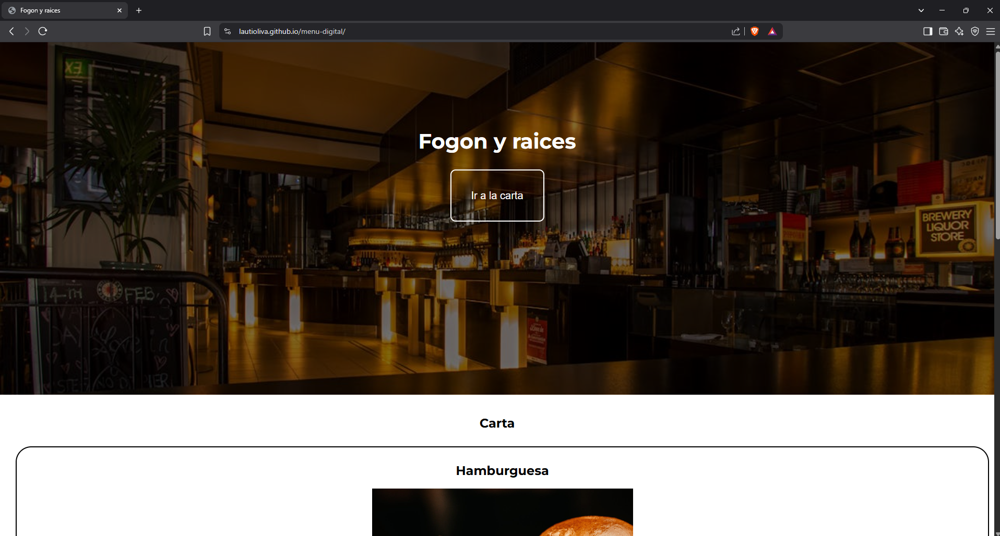

# 🍽️ Menú Digital

Este es un proyecto simple y moderno de un **menú digital** para un restaurante ficticio llamado **Fogón y Raíces**, desarrollado utilizando solamente **HTML y CSS**. El sitio presenta una interfaz visual atractiva con imágenes, precios y descripciones de los platos.

## 🌐 Deploy

👉 [Ver sitio en GitHub Pages](https://lautioliva.github.io/menu-digital/)

---

## 🖼️ Captura del sitio

 <!-- Asegurate de tener esta imagen subida -->

---

## 📌 Funcionalidades

- Sección principal con imagen destacada del restaurante.
- Botón decorativo "Ir a la carta".
- Listado de platos con:
  - Nombre
  - Imagen
  - Descripción
  - Precio
- Estilo responsive básico usando solo CSS puro.

---

## 🧰 Tecnologías usadas

- ✅ HTML5
- ✅ CSS3
- ✅ Google Fonts (`Montserrat`)
- 🚫 Sin JavaScript ni frameworks

---

## 📂 Estructura del proyecto

```txt
menu-digital/
├── index.html               # Página principal
├── css/
│   └── style.css            # Estilos del sitio
├── img/
│   ├── restaurante.jpg      # Imagen del header
│   ├── hamburguesa.jpg      # Plato 1
│   ├── pastas.jpg           # Plato 2
│   ├── carne-con-verduras.jpg # Plato 3
│   └── proyecto.png         # Captura para README
└── README.md                # Este archivo
```

🧠 Aprendizajes

Con este proyecto pude practicar y aplicar:

Uso de imágenes de fondo con `background-image` y `linear-gradient`.

Estilizado de botones con transiciones.

Maquetación básica con `margin`, `padding`, `border-radius`, y `box-shadow`.

Buenas prácticas de organización de archivos.

⚙️ Cómo correrlo localmente
```
git clone https://github.com/lautioliva/menu-digital.git
```
🚀 Próximas mejoras (ideas)
Agregar interactividad con JavaScript 

Hacerlo completamente responsive con media queries.

Incluir sección de contacto o ubicación.